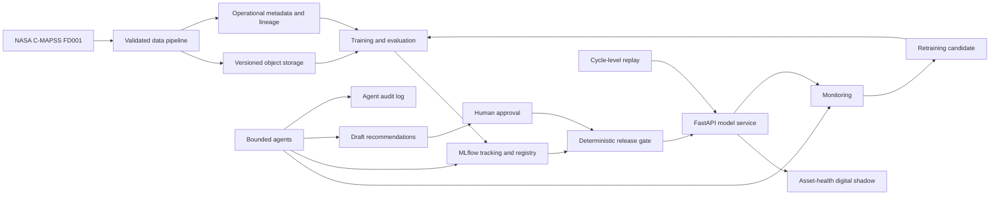
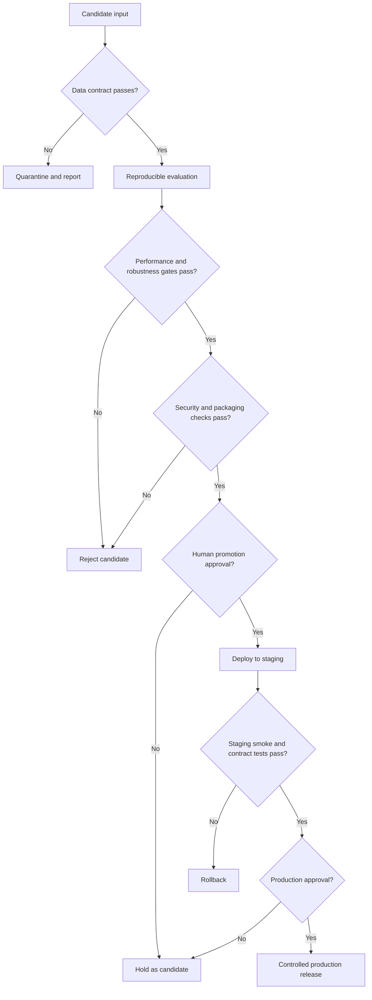

# Master Architecture

## Status

This is the master target architecture. Phase 0 foundation artifacts exist and
Phase 1 is planned but not started. Components assigned to later phases are
designs, not working integrations.

## Architectural principles

1. Deterministic checks and human approvals hold decision authority.
1. Core Python logic remains independent of orchestration and cloud adapters.
1. The system begins as a modular monolith.
1. Immutable inputs and versioned outputs precede automation.
1. Cloud services are introduced only after local behavior is tested.
1. Metadata has one authoritative owner; references prevent duplication.
1. Mocked, emulated, replayed, staging, and production evidence are distinct.
1. Failure, rollback, and recovery paths are first-class architecture.

## System context



Arrows show intended information flow, not current implementation.

## Component model

### Data plane

| Component           | Responsibility                                           | Earliest phase |
| ------------------- | -------------------------------------------------------- | -------------- |
| Source adapter      | Identify and read an approved C-MAPSS source             | 1              |
| Integrity service   | Compute and verify cryptographic checksums               | 1              |
| Contract validator  | Enforce schema and semantic invariants                   | 1              |
| Transformer         | Produce deterministic processed datasets                 | 3              |
| Feature builder     | Produce versioned, reproducible feature snapshots        | 3              |
| Object repository   | Store raw, processed, feature, model, and report objects | 2              |
| Metadata repository | Store manifests, lineage, states, approvals, and audits  | 2              |

### Model plane

| Component         | Responsibility                                      | Earliest phase |
| ----------------- | --------------------------------------------------- | -------------- |
| Split service     | Leakage-safe engine-level dataset partitions        | 4              |
| Trainer/evaluator | Fit and evaluate reproducible candidates            | 4              |
| MLflow            | Own experiment and registered-model metadata        | 4              |
| Promotion gate    | Apply deterministic criteria and capture approval   | 6              |
| Release packager  | Bind model, signature, dependencies, and provenance | 6              |
| Inference API     | Validate requests and serve one approved release    | 6              |

### Operations plane

| Component             | Responsibility                                              | Earliest phase |
| --------------------- | ----------------------------------------------------------- | -------------- |
| Airflow               | Schedule and observe already-tested batch functions         | 3              |
| Monitor               | Evaluate data, prediction, service, and performance signals | 7              |
| Retraining controller | Open candidate evaluations without promotion authority      | 7              |
| Digital-shadow store  | Hold the latest versioned asset-health state                | 6              |
| Dashboard             | Render state, uncertainty, provenance, and audit evidence   | 9              |

### Agent plane

Agents are sidecar decision-support components, not a control plane. They may
read approved reports and metadata. Any allowed write is confined to a draft or
recommendation namespace. They cannot modify source data, validation outcomes,
registered production aliases, deployments, approval records, or maintenance
execution systems.

## Data architecture

### Object-storage zones

The logical zones are:

```text
raw/<dataset>/<source-version>/<sha256>/<filename>
processed/<dataset>/<contract-version>/<snapshot-id>/...
features/<dataset>/<feature-set-version>/<snapshot-id>/...
models/<registered-name>/<model-version>/...
reports/<report-type>/<run-or-window-id>/...
```

The final bucket layout is decided in Phase 2. Logical zones do not imply AWS
S3. Supabase Storage's S3 protocol is an adapter option.

Raw immutability is application-enforced:

- the SHA-256 digest is part of the object identity;
- overwrite/upsert is denied in the raw-data path;
- a manifest records source, size, digest, uploader, and ingestion time;
- consumers verify the digest before use; and
- deletion requires a separately approved retention operation.

This is not compliance-grade WORM. Supabase Storage currently has no S3 object
versioning or object locking. Backups must cover object bytes and metadata.

### Metadata ownership

| Metadata                                 | Authoritative owner    |
| ---------------------------------------- | ---------------------- |
| Dataset snapshots and lineage            | Operational PostgreSQL |
| Feature snapshot lineage                 | Operational PostgreSQL |
| Experiments, metrics, run artifacts      | MLflow                 |
| Registered model versions and aliases    | MLflow                 |
| Promotion and deployment approvals       | Operational PostgreSQL |
| Asset-health state                       | Operational PostgreSQL |
| Monitoring windows and report references | Operational PostgreSQL |
| Agent tool calls and recommendations     | Operational PostgreSQL |

Cross-system identifiers are stored as references. Model metrics are not copied
into operational tables except for an immutable approval evidence snapshot.

### Planned PostgreSQL schemas

- `ops`: ingestion, lineage, approval, deployment, and monitoring records.
- `twin`: asset-health digital-shadow state and history.
- `audit`: append-only security and agent decision records.
- `api`: explicitly exposed views or functions if a dashboard later needs the
  Supabase Data API.

Internal schemas are not exposed to the Data API. Any exposed object requires
explicit grants and row-level security. A dedicated MLflow backend is preferred;
sharing the operational schema is prohibited.

## Digital-shadow state

The planned state contract includes:

- asset identifier and source cycle;
- current validated telemetry reference;
- feature snapshot and data-contract versions;
- RUL estimate and uncertainty;
- failure-risk probability, decision threshold, and horizon;
- health-state cluster and anomaly score when available;
- model and release versions;
- inference timestamp and data freshness;
- validation and monitoring status; and
- recommendation and audit references.

The state is derived and unidirectional. It cannot control a physical engine.

## Control flow and gates



Agents may supply evidence to a gate. They cannot change gate outcomes.

## Environment topology

| Environment       | Purpose                                                   | External effects           |
| ----------------- | --------------------------------------------------------- | -------------------------- |
| Local             | Development, unit tests, deterministic pipeline execution | None by default            |
| CI                | Reproducible checks on pull requests                      | No deployment              |
| Cloud integration | Explicit Supabase and service verification                | Test namespaces only       |
| Staging           | API, model, monitoring, and rollback validation           | Non-production             |
| Production        | Later demonstration target                                | Explicit approval required |

Configuration flows through environment variables or secret stores. Source code
does not infer an environment from a credential value.

## Trust boundaries

1. Developer workstation to GitHub.
1. GitHub Actions to any external service.
1. Application backend to Supabase PostgreSQL and Storage.
1. MLflow clients to the tracking server and artifact store.
1. Dashboard/browser to exposed API surfaces.
1. Agent runtime to approved tools.
1. Maintenance recommendation to a human decision maker.

Every crossing requires authenticated identity, least privilege, input
validation, logging, and a documented failure mode.

## Failure and recovery design

| Failure                  | Required behavior                                    |
| ------------------------ | ---------------------------------------------------- |
| Checksum mismatch        | Reject and quarantine; never transform               |
| Contract violation       | Emit structured report; do not publish derived data  |
| Partial object upload    | No manifest commit; safe retry                       |
| Duplicate ingestion      | Return existing identity or prove conflict           |
| Metadata/object mismatch | Mark lineage invalid and block downstream use        |
| Training interruption    | Preserve run status; do not register candidate       |
| Gate failure             | Retain evidence; prohibit promotion                  |
| Serving load failure     | Fail readiness and keep previous release             |
| Drift alert              | Open investigation; do not retrain automatically     |
| Agent/tool failure       | Fail closed and preserve an audit event              |
| Missing delayed labels   | Report unavailable performance, not zero degradation |

## Technology decisions

- Python 3.11 is the Phase 0 baseline.
- Pandera is the initial DataFrame contract library.
- scikit-learn precedes deep learning.
- MLflow owns experiment and registry metadata.
- FastAPI is the planned inference boundary.
- Airflow is batch orchestration introduced after local ETL.
- Supabase file buckets and PostgreSQL are planned cloud adapters.
- Evidently remains optional; custom, testable metrics are the baseline.
- Docker Compose is introduced only with runnable services.

Accepted decisions and alternatives are recorded in `docs/adr/`.

## External references

- [NASA C-MAPSS technical memorandum](https://ntrs.nasa.gov/api/citations/20120007104/downloads/20120007104.pdf)
- [Supabase Storage](https://supabase.com/docs/guides/storage)
- [Supabase S3 compatibility](https://supabase.com/docs/guides/storage/s3/compatibility)
- [Supabase API security](https://supabase.com/docs/guides/api/securing-your-api)
- [MLflow tracking architecture](https://mlflow.org/docs/latest/ml/tracking)
- [Airflow overview](https://airflow.apache.org/docs/apache-airflow/stable/index.html)
