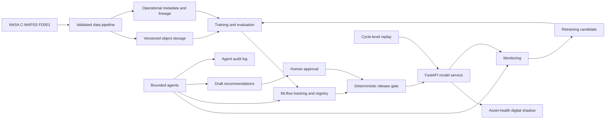
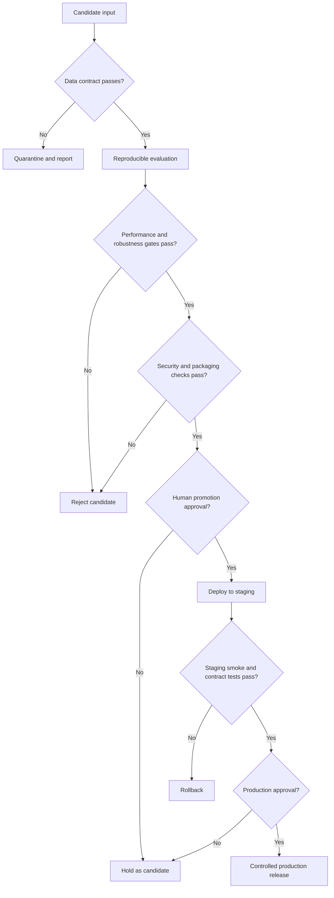

# Master Architecture

## Status

This is the master target architecture. Phases 0 through 6 are implemented,
validated, and owner-approved. The exact Phase 6 FD001 release passed the
deterministic gate, was published privately, and is active only on the loopback
staging service. Production, public ingress, automatic promotion, and working
UI remain unavailable.

## Architectural principles

1. Deterministic checks and human approvals hold decision authority.
1. Core Python logic remains independent of orchestration and cloud adapters.
1. The system begins as a modular monolith.
1. Immutable inputs and versioned outputs precede automation.
1. Cloud services are introduced only after local behavior is tested.
1. Metadata has one authoritative owner; references prevent duplication.
1. Mocked, emulated, replayed, staging, and production evidence are distinct.
1. Failure, rollback, and recovery paths are first-class architecture.
1. UI design starts early, but a screen connects only after its versioned
   backend contract is stable and tested.

## System context



Arrows show intended information flow, not current implementation.

## Component model

### Data plane

| Component           | Responsibility                                           | Earliest phase |
| ------------------- | -------------------------------------------------------- | -------------- |
| Source adapter      | Identify and read an approved C-MAPSS source             | 1              |
| Integrity service   | Compute and verify cryptographic checksums               | 1              |
| Contract validator  | Enforce schema and semantic invariants                   | 1              |
| Transformer         | Produce deterministic processed datasets                 | 3              |
| Feature builder     | Produce versioned, reproducible feature snapshots        | 3              |
| Object repository   | Store raw, processed, feature, model, and report objects | 2              |
| Metadata repository | Store manifests, lineage, states, approvals, and audits  | 2              |

### Model plane

| Component         | Responsibility                                      | Earliest phase |
| ----------------- | --------------------------------------------------- | -------------- |
| Split service     | Leakage-safe engine-level dataset partitions        | 4              |
| Trainer/evaluator | Fit and evaluate reproducible candidates            | 4              |
| MLflow            | Own experiment and registered-model metadata        | 4              |
| Promotion gate    | Apply deterministic criteria and capture approval   | 6              |
| Release packager  | Bind model, signature, dependencies, and provenance | 6              |
| Inference API     | Validate requests and serve one approved release    | 6              |

### Operations plane

| Component             | Responsibility                                              | Earliest phase |
| --------------------- | ----------------------------------------------------------- | -------------- |
| Airflow               | Schedule and observe already-tested batch functions         | 3              |
| Monitor               | Evaluate data, prediction, service, and performance signals | 7              |
| Retraining controller | Open candidate evaluations without promotion authority      | 7              |
| Digital-shadow store  | Hold the latest versioned asset-health state                | 9              |
| Dashboard design      | Define screen hierarchy, states, wording, and dependencies  | 6              |
| Dashboard runtime     | Render stable state, provenance, monitoring, and audit APIs | 9              |

### Agent plane

Agents are sidecar decision-support components, not a control plane. They may
read approved reports and metadata. Any allowed write is confined to a draft or
recommendation namespace. They cannot modify source data, validation outcomes,
registered production aliases, deployments, approval records, or maintenance
execution systems.

## Data architecture

### Object-storage zones

The logical zones are:

```text
raw/<dataset>/<snapshot-id>/<sha256>/<filename>
processed/<dataset>/<contract-version>/<snapshot-id>/...
features/<dataset>/<feature-set-version>/<snapshot-id>/...
models/<registered-name>/<model-version>/...
reports/<report-type>/<run-or-window-id>/...
```

Phase 2 defines two private Storage buckets: one raw bucket and one derived
bucket. Phase 3 uses content-addressed `processed`, `features`, and
`reports/data-quality` prefixes in the derived bucket. Local tests use a
filesystem substitute with the same narrow put-if-absent contract. The
Supabase adapter uses the standard Storage API. Phase 3 hosted derived evidence
is not claimed until its separately approved run passes. Logical zones do not
imply AWS S3, and the Supabase S3 protocol remains deferred.

Raw immutability is application-enforced:

- the SHA-256 digest is part of the object identity;
- overwrite/upsert is denied in the raw-data path;
- a manifest records source, size, digest, uploader, and ingestion time;
- consumers verify the digest before use; and
- deletion requires a separately approved retention operation.

This is not compliance-grade WORM. Supabase Storage currently has no S3 object
versioning or object locking. Backups must cover object bytes and metadata.

### Metadata ownership

| Metadata                                 | Authoritative owner    |
| ---------------------------------------- | ---------------------- |
| Dataset snapshots and lineage            | Operational PostgreSQL |
| Feature snapshot lineage                 | Operational PostgreSQL |
| Experiments, metrics, run artifacts      | MLflow                 |
| Registered model versions and aliases    | MLflow                 |
| Promotion and deployment approvals       | Operational PostgreSQL |
| Asset-health state                       | Operational PostgreSQL |
| Monitoring windows and report references | Operational PostgreSQL |
| Agent tool calls and recommendations     | Operational PostgreSQL |

Cross-system identifiers are stored as references. Model metrics are not copied
into operational tables except for an immutable approval evidence snapshot.

### PostgreSQL schemas

- `ops`: owns five Phase 2 ingestion tables and three Phase 3 derived-snapshot,
  derived-file, and transformation-run tables. Later approval, deployment, and
  monitoring objects require their owning phases and new migrations.
- `twin`: asset-health digital-shadow state and history.
- `audit`: append-only security and agent decision records.
- `api`: explicitly exposed views or functions if a dashboard later needs the
  Supabase Data API.

Internal schemas are not exposed to the Data API. Any exposed object requires
explicit grants and row-level security. A dedicated MLflow backend is preferred;
sharing the operational schema is prohibited.

## Digital-shadow state

The planned state contract includes:

- asset identifier and source cycle;
- current validated telemetry reference;
- feature snapshot and data-contract versions;
- RUL estimate and uncertainty;
- failure-risk probability, decision threshold, and horizon;
- health-state cluster and anomaly score when available;
- model and release versions;
- inference timestamp and data freshness;
- validation and monitoring status; and
- recommendation and audit references.

The state is derived and unidirectional. It cannot control a physical engine.

## Control flow and gates



Agents may supply evidence to a gate. They cannot change gate outcomes.

## Environment topology

| Environment       | Purpose                                                   | External effects           |
| ----------------- | --------------------------------------------------------- | -------------------------- |
| Local             | Development, unit tests, deterministic pipeline execution | None by default            |
| CI                | Reproducible checks on pull requests                      | No deployment              |
| Cloud integration | Explicit Supabase and service verification                | Test namespaces only       |
| Staging           | API, model, monitoring, and rollback validation           | Non-production             |
| Production        | Later demonstration target                                | Explicit approval required |

Configuration flows through environment variables or secret stores. Source code
does not infer an environment from a credential value.

## Trust boundaries

1. Developer workstation to GitHub.
1. GitHub Actions to any external service.
1. Application backend to Supabase PostgreSQL and Storage.
1. MLflow clients to the tracking server and artifact store.
1. Dashboard/browser to exposed API surfaces.
1. Agent runtime to approved tools.
1. Maintenance recommendation to a human decision maker.

Every crossing requires authenticated identity, least privilege, input
validation, logging, and a documented failure mode.

## UI delivery boundary

The dashboard follows a design-first, contract-gated sequence documented in
[`UI_ARCHITECTURE.md`](UI_ARCHITECTURE.md). Phase 6 creates technology-neutral
screen designs and dependency maps only. Phases 6 through 8 stabilize the
release, inference, monitoring, recommendation, and audit contracts owned by
those phases. Phase 9 selects the frontend stack, implements the working UI,
and connects one screen at a time after all of that screen's dependencies are
stable.

The browser never reads internal PostgreSQL schemas, Storage objects, or MLflow
directly. A later versioned read boundary provides only the fields required by
the dashboard. Mock or fixture data may support design and component tests but
cannot be called a connected integration.

## Failure and recovery design

| Failure                  | Required behavior                                    |
| ------------------------ | ---------------------------------------------------- |
| Checksum mismatch        | Reject and quarantine; never transform               |
| Contract violation       | Emit structured report; do not publish derived data  |
| Partial object upload    | No manifest commit; safe retry                       |
| Duplicate ingestion      | Return existing identity or prove conflict           |
| Metadata/object mismatch | Mark lineage invalid and block downstream use        |
| Training interruption    | Preserve run status; do not register candidate       |
| Gate failure             | Retain evidence; prohibit promotion                  |
| Serving load failure     | Fail readiness and keep previous release             |
| Drift alert              | Open investigation; do not retrain automatically     |
| Agent/tool failure       | Fail closed and preserve an audit event              |
| Missing delayed labels   | Report unavailable performance, not zero degradation |

## Phase 3 implemented boundary

Phase 3 implements deterministic processed, candidate-feature, target,
manifest, and data-quality artifacts. It extends the existing
content-addressed object and private PostgreSQL lineage model; it does not add a
feature-store product or row-level telemetry database.

Core ETL is ordinary typed Python and runs without Airflow. The thin
`fd001_derived_pipeline` DAG owns schedule, dependencies, bounded retries,
timeouts, failure history, and backfill execution. XCom is restricted to the
source ID, three derived IDs, and a reuse boolean. The local runtime uses the
official Airflow 3.3.0 Python 3.11 image pinned by digest, `LocalExecutor`, and a
dedicated Airflow database/user inside the disposable PostgreSQL 17 service.
It includes no Celery, Redis, Kubernetes, streaming, or production hosting.

Scheduled runs use an explicitly configured `PM_SOURCE_SNAPSHOT_ID`; manual and
backfill runs may provide the same ID in run configuration. A missing or
invalid ID fails closed. Logical dates and Airflow run IDs are excluded from
artifact identity, so backfills over the static source reuse one artifact set.

The first feature snapshot separates three settings and 21 sensors from
uncapped RUL and inclusive 30-cycle risk targets. It performs no fitted
scaling, selection, PCA, imputation, rolling aggregation, or model-informed
engineering. Split-fitted preprocessing remains Phase 4 work.

## Phase 4 implemented boundary

Phase 4 reads one explicit available and reconciled
`fd001-candidate-features-v1` snapshot. `engine_id` and `cycle` remain identity
and grouping keys; the model matrix is limited to the three settings and 21
sensors. Labels remain in separate target files.

One canonical split manifest is shared by both tasks. A seeded
engine-group split assigns 80% of NASA training engines to fit and 20% to
validation; the NASA test partition remains the final holdout. All fitted
preprocessing is inside scikit-learn pipelines and sees training engines only.
Engine-balanced validation RMSE and average precision are the primary metrics,
with pooled, lifecycle-band, calibration, and final-cycle evidence reported
separately.

The fixed baselines are median dummy versus scaled Ridge for uncapped RUL, and
prior dummy versus scaled class-balanced logistic regression for inclusive
30-cycle risk. A candidate is eligible only if it beats its dummy on the
predeclared validation metric. Hyperparameter search, target capping, feature
selection, threshold optimization, and advanced models remain Phase 5.

MLflow runs only on loopback with a local SQLite backend and ignored local
artifact root. It owns experiment runs, metrics, signatures, reports, and
trusted `skops` model artifacts. It does not share the operational `ops`
schema. Registered-model versions, aliases, approvals, promotion, serving, and
remote MLflow remain outside Phase 4.

## Phase 5 implemented boundary

Phase 5 reuses the exact verified FD001 feature snapshot and input columns. It
does not change labels, cap RUL, add rolling features, or ingest FD002-FD004.
This isolates model-family complexity from data and target changes.

The Phase 4 80/20 split remains immutable evidence. Phase 5 adds a child
nested-cross-validation manifest over the 100 NASA source-training engines:
five outer engine-group folds for comparison and four inner engine-group folds
for a finite histogram-gradient-boosting search. The Phase 4 Ridge and logistic
models are re-evaluated on the same outer folds. Whole-engine paired bootstrap
intervals and practical guardrails decide whether the advanced model is
preferred. Failure to pass retains the baseline.

The NASA test partition is a locked benchmark, not a blind holdout, because
its Phase 4 metrics are already known. A separate evaluation path requires a
content-addressed locked-selection record and prohibits configuration changes.

Unsupervised work is isolated from supervised selection. Training-only,
engine-balanced KMeans/PCA analysis may identify exploratory telemetry states,
and Isolation Forest may produce a novelty score. Neither has ground-truth
state or anomaly labels. Explainability uses held-out outer-fold evidence and
cannot silently feed feature selection or retuning.

Phase 5 reuses loopback SQLite-backed MLflow for evidence only. Registry,
promotion, FastAPI, serving, deployment, Supabase mutation, Airflow training,
monitoring, retraining, agents, and dashboards remain outside its boundary. A
multi-task neural network is excluded by default because the classification
label is a deterministic threshold of RUL; adding one requires a separate
approved plan amendment and ablation hypothesis.

## Phase 6 implementation boundary

Phase 6 registers the exact Phase 5 selected models as candidate versions
in the existing database-backed local MLflow registry. MLflow owns registered
names, versions, tags, and aliases. Private operational PostgreSQL owns
append-only release approval, deployment, and rollback evidence. Registration
alone grants no deployment authority.

One canonical release binds the selected regression and classification model
versions, their trusted `skops` artifacts and signatures, all Phase 5 evidence
identities, the exact 24-feature contract, dependency-lock digest, approval,
and previous staging release. A deterministic approval-request ID avoids a
circular hash while the later human decision binds both the request and exact
release IDs. The service loads this immutable release at
startup and never follows a mutable MLflow alias for each request.

The inference boundary is a bounded FastAPI `/v1` contract with separate
liveness and verified-model readiness. It returns non-negative RUL and
inclusive 30-cycle failure-risk outputs with immutable provenance. It reports
that per-prediction uncertainty is unavailable; Phase 5 evaluation intervals
are not prediction intervals.

The default staging topology is one release-specific, non-root container bound
to loopback with candidate-slot smoke testing and rollback to a previous
immutable release. Pull-request CI builds and tests a synthetic release but
does not deploy. A separate manual workflow references a protected `staging`
environment. There is no Phase 6 public endpoint, production target, automatic
promotion, monitoring, agent, working dashboard, or digital-shadow persistence.
Phase 6 does create the early technology-neutral UI design and screen-to-contract
map; it adds no frontend code or live connection.

## Technology decisions

- Python 3.11 is the Phase 0 baseline.
- Pandera is the initial DataFrame contract library.
- scikit-learn precedes deep learning.
- MLflow owns experiment and registry metadata.
- FastAPI is the implemented Phase 6 inference boundary.
- Airflow is batch orchestration introduced after local ETL.
- Supabase Storage and direct PostgreSQL are the Phase 2 cloud adapters.
  Filesystem plus PostgreSQL 17 are the exercised local substitutes.
- Evidently remains optional; custom, testable metrics are the baseline.
- Docker Compose is introduced only with runnable services.

Accepted decisions and alternatives are recorded in `docs/adr/`.

## External references

- [NASA C-MAPSS technical memorandum](https://ntrs.nasa.gov/api/citations/20120007104/downloads/20120007104.pdf)
- [Supabase Storage](https://supabase.com/docs/guides/storage)
- [Supabase S3 compatibility](https://supabase.com/docs/guides/storage/s3/compatibility)
- [Supabase API security](https://supabase.com/docs/guides/api/securing-your-api)
- [MLflow tracking architecture](https://mlflow.org/docs/latest/ml/tracking)
- [Airflow overview](https://airflow.apache.org/docs/apache-airflow/stable/index.html)
