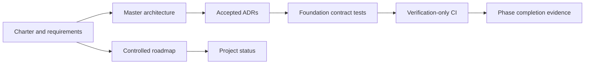

# Phase 0 Architecture

## Objective

Create the governance and architecture baseline required to implement later
phases safely, reproducibly, and one at a time.

## Inputs

- The owner's project assignment and technology proposal.
- Explicit `START PHASE 0` authorization.
- An initially uninitialized repository.
- Current primary documentation for selected external technologies.

The existing `Data/` directory is not a Phase 0 input and remains untouched.

## Outputs

Phase 0 creates documents, repository policies, locked quality tooling,
foundation tests, and CI. It creates no application module, database migration,
dataset transform, model, API, DAG, dashboard, cloud resource, or agent.

## Architecture boundaries established

- source-of-truth and phase-transition authority;
- research terminology and claims;
- modular-monolith and local-first structure;
- logical data/model/operations/agent planes;
- Supabase trust and storage boundaries;
- MLflow metadata ownership;
- Airflow orchestration boundary;
- CI/CD and model-promotion separation;
- threat model and secret handling; and
- test and evidence standards.

## Repository state after Phase 0

Only foundation artifacts are tracked. Future directories are documented in
the master architecture but are created by their owning phases. User-provided
raw data is ignored.

## Failure behavior

- Missing required documents fail foundation tests.
- Conflicting phase states fail foundation tests.
- A secret-like value in `.env.example` fails foundation tests.
- A later-phase implementation directory fails the Phase 0 contract.
- A deployment command in pull-request CI fails the integration contract.
- Missing GitHub CI evidence leaves Phase 0 incomplete.

## Risks

| Risk                                          | Treatment                                              |
| --------------------------------------------- | ------------------------------------------------------ |
| Foundation becomes speculative implementation | Prohibit feature/service directories                   |
| Architecture claims exceed evidence           | ADR-0002 and explicit vocabulary                       |
| Tooling burden exceeds value                  | Single Python/uv environment, minimal CI               |
| User data enters Git                          | Root ignore rules and contract tests                   |
| Cloud defaults change                         | Re-verify official documentation in owning phase       |
| Remote evidence unavailable                   | Keep status in progress and request exact owner action |
