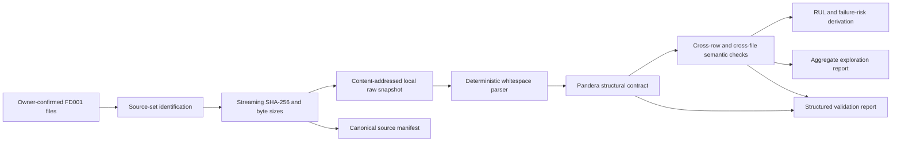

# Phase 1 Architecture

## Objective

Establish a reproducible, local-only boundary that identifies the current
C-MAPSS FD001 source, preserves its exact bytes in a content-addressed snapshot,
parses cycle observations deterministically, validates structural and semantic
contracts, defines RUL and failure-risk labels, and records dataset exploration
evidence.

Phase 1 does not train a model, publish processed datasets, run Airflow, contact
Supabase, or implement a telemetry streaming service.

## Scope

The required data inputs are:

- `Data/train_FD001.txt`;
- `Data/test_FD001.txt`;
- `Data/RUL_FD001.txt`; and
- `Data/readme.txt` as source documentation.

The local supporting paper may be cited and checksummed as provenance evidence,
but it is not a tabular ingestion input. FD002, FD003, and FD004 remain out of
scope.

## Component flow



Each stage fails closed. A checksum, parse, schema, or semantic failure prevents
the snapshot from being reported as accepted.

## Module boundaries

| Module        | Responsibility                                                      |
| ------------- | ------------------------------------------------------------------- |
| `contract`    | Stable filenames, columns, versions, citation, errors               |
| `integrity`   | Stream hashes, copy exact bytes, verify destination, write manifest |
| `parser`      | Parse whitespace-separated telemetry and terminal RUL               |
| `validation`  | Run Pandera schema checks and project-owned semantic invariants     |
| `labels`      | Derive train/test RUL and horizon-based failure-risk labels         |
| `exploration` | Produce aggregate, reproducible dataset observations                |
| `pipeline`    | Compose accepted in-memory Phase 1 outputs                          |
| `cli`         | Write ignored local evidence without owning domain logic            |

The package remains a modular monolith. Interfaces are ordinary typed Python
functions and immutable data classes; no repository abstraction or plugin
system is needed for local files.

## Raw snapshot contract

- Source files are opened read-only and never modified.
- SHA-256 is computed over exact bytes using bounded-memory streaming.
- The destination path includes the source-set snapshot digest; files retain
  their original logical basenames within it.
- Copy creation is exclusive; overwrite and upsert are prohibited.
- The destination digest is verified after copying.
- An existing exact destination is idempotently reused only after verification.
- A canonical manifest records logical source identity, NASA citation and URL,
  filenames, byte sizes, digests, contract version, parser version, and code
  revision.
- Absolute workstation paths and usernames are not written to reports.

This is application-enforced local immutability, not WORM storage.

## Parsed observation contract

An FD001 observation represents one simulated engine at one integer cycle:

```text
engine_id, cycle, setting_1..setting_3, sensor_1..sensor_21
```

The parser preserves source row order and accepts variable ASCII whitespace. It
does not silently sort, impute, drop, or coerce invalid values. Structural
validation requires exactly 26 numeric columns. Semantic validation covers:

- positive integral engine identifiers and cycles;
- unique `(engine_id, cycle)` keys;
- cycles starting at 1 and increasing by one within each engine in source
  order;
- finite settings and sensor values;
- no missing values;
- required train/test/RUL file relationships; and
- unambiguous mapping of one terminal RUL value to each test engine.

Observed ranges and low-variance sensors are profile evidence, not universal
physical limits.

## Label contract

The canonical RUL label is uncapped.

For training observations:

```text
rul = max_train_cycle_for_engine - cycle
```

For test observations, where the supplied value is RUL at the last observed
cycle:

```text
rul = max_test_cycle_for_engine + terminal_rul - cycle
```

The endpoint and boundary examples must be tested. Any capped RUL is a separate,
explicitly configured derived view; it may not replace the uncapped label
silently.

The primary failure-risk view uses a declared 30-cycle horizon:

```text
failure_risk_30 = 1 when rul <= 30, otherwise 0
```

The exploration report also records label prevalence at 15- and 45-cycle
horizons so later modeling can assess sensitivity. These are derived labels,
not observed failures.

## Telemetry and replay semantics

Rows are historical simulated cycle observations and may be called C-MAPSS
telemetry. `cycle` is an ordered sequence coordinate, not a wall-clock event
time. Phase 1 does not create synthetic timestamps or claim real-time
ingestion. A later replay component may attach a separate replay timestamp
while preserving engine ID, source cycle, snapshot ID, and row provenance.

## Failure outputs

Validation failures produce project-owned structured issues with stable rule
IDs, error severity, affected logical file, counts, and at most five sanitized
examples. Reports must not contain credentials, private URLs, absolute
workstation paths, or an unbounded copy of raw rows.

## Exercised implementation

The local pipeline was exercised on the owner-provided files and accepted
20,631 train rows and 13,096 test rows across 100 engines in each partition.
The source-set identity and aggregate findings are recorded in
`docs/DATA_CONTRACT.md` and `DATA_EXPLORATION.md`. This is local evidence; it is
not a cloud integration.

## Explicit exclusions

- FD002-FD004 ingestion;
- processed or feature snapshot publication;
- model splitting, fitting, metrics, or MLflow;
- Supabase, PostgreSQL, Airflow, FastAPI, Docker, agents, or dashboards;
- streaming transports and synthetic event-time generation; and
- universal claims about physical sensor limits or industrial performance.
