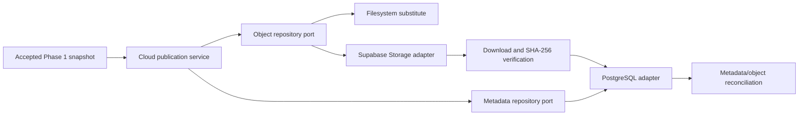
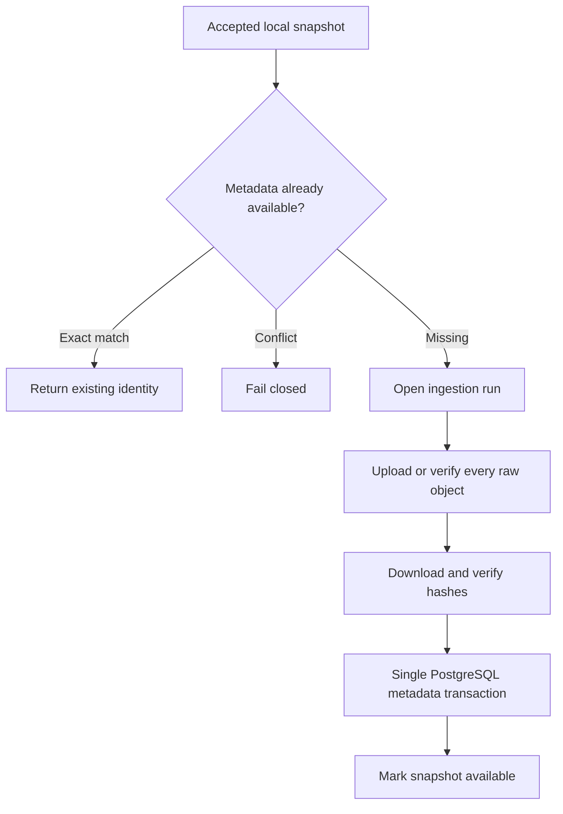

# Phase 2 Architecture

## Objective

Add a governed cloud persistence boundary for the accepted FD001 snapshot. The
phase will store exact raw objects in private Supabase Storage, record
operational metadata and lineage in private PostgreSQL tables, and prove
idempotent behavior locally and against one explicitly approved Supabase
development/test project.

Phase 2 does not transform telemetry, create processed or feature content, run
Airflow, train models, configure MLflow, expose a dashboard API, enable Auth or
Realtime, or provision a production deployment.

## Scope correction

The roadmap phrase "S3 raw, processed and feature zones" means logical
object-storage zones. It does not require Amazon S3, a data-lake product, or the
Supabase S3 protocol.

The planned primary adapter uses the Supabase Storage API because uploads reject
an existing path by default when upsert is disabled. The S3 protocol remains
optional and will not be enabled in Phase 2 unless the owner explicitly
approves it and the exact required operations are verified. Supabase Storage
does not provide S3 object versioning or object lock.

## Component flow



The application service owns ordering and failure behavior. Storage and
PostgreSQL adapters do not redefine snapshot identity or the Phase 1 data
contract.

## Implemented package boundaries

```text
src/predictive_maintenance/cloud/
  config.py
  models.py
  object_store.py
  metadata.py
  publication.py
  cli.py
```

- `object_store` defines the narrow object-repository protocol and filesystem
  and Supabase adapters.
- `metadata` defines the metadata protocol and PostgreSQL implementation.
- `publication` coordinates verified object writes and one metadata
  transaction.
- `config` loads validated environment settings without printing secret values.
- `cli` composes adapters and reports sanitized identities and outcomes.

This remains one Python modular monolith. It does not introduce a service,
generic plugin framework, or repository abstraction for domains that do not
need one.

## Storage topology

Two private buckets are planned:

| Bucket role | Contents in Phase 2                              | Reason for separation                                          |
| ----------- | ------------------------------------------------ | -------------------------------------------------------------- |
| Raw         | Exact FD001 source files and manifest            | Different overwrite, deletion, and retention rules             |
| Derived     | No production data; integration-test prefix only | Reserves `processed/` and `features/` without implementing ETL |

Bucket names are configuration, not code-level identities. Suggested local
defaults are `pm-raw` and `pm-derived`; the owner must approve names for the
target project.

Raw keys use:

```text
fd001/<snapshot-id>/<file-sha256>/<logical-filename>
fd001/<snapshot-id>/manifest.json
```

The derived bucket reserves:

```text
processed/<dataset>/<contract-version>/<snapshot-id>/...
features/<dataset>/<feature-set-version>/<snapshot-id>/...
_integration/<run-id>/...
```

Phase 2 does not publish real processed or feature objects. Their data format
belongs to Phase 3. The local substitute stores only raw publication evidence;
the derived namespace is reserved for a guarded hosted integration probe.

All buckets are private. Public URLs, signed URLs, object updates, and raw
deletion are absent from the normal publication interface.

## Raw overwrite and verification rules

- Upload uses the existing content-addressed key and explicitly disables
  upsert.
- The first concurrent writer succeeds; another writer must receive
  already-exists behavior and then verify the stored object.
- Existing objects are accepted only when logical key, byte size, and downloaded
  SHA-256 all match.
- Different bytes at an existing key are a conflict and block metadata
  publication.
- Every cloud object is downloaded and rehashed before it becomes `available`
  in operational metadata.
- Raw deletion requires a separate administrative retention operation that is
  not implemented in Phase 2.

These controls are application-enforced. A server secret or S3 access key can
bypass Storage RLS, so credential isolation remains part of the trust boundary.
This design is not WORM.

## PostgreSQL ownership

Phase 2 creates only the private `ops` schema. It does not create `api`, `twin`,
or agent-audit objects.

The planned minimum tables are:

| Table                   | Responsibility                                                                      |
| ----------------------- | ----------------------------------------------------------------------------------- |
| `ops.dataset_snapshots` | Accepted snapshot identity, contract/parser versions, manifest digest, availability |
| `ops.data_objects`      | Bucket, key, zone, SHA-256, byte size, content type, verification state             |
| `ops.snapshot_files`    | Ordered logical files belonging to a snapshot                                       |
| `ops.lineage_edges`     | Parent-child object references and relationship type                                |
| `ops.ingestion_runs`    | Idempotency key, lifecycle state, timestamps, and sanitized error code              |

Text values use explicit check constraints rather than PostgreSQL enums so
states can evolve through ordinary migrations. Timestamps are `timestamptz`.
Object identities use bucket and object key; random identifiers do not replace
content identity.

The migration will:

- create the private schema and tables with primary, foreign, unique, and check
  constraints;
- revoke access from `PUBLIC`, `anon`, and `authenticated`;
- create a least-privilege no-login runtime role used with `SET ROLE`;
- enable RLS as defense in depth where it provides a testable restriction;
- avoid custom tables or functions in Supabase-managed `auth`, `storage`, and
  `realtime` schemas; and
- expose no object through the Data API.

The application connects directly to PostgreSQL. It does not use the Data API
for internal operational metadata.

## Idempotency and dual-write behavior

The Phase 1 `snapshot_id` is the natural idempotency identity.



Storage and PostgreSQL cannot share one transaction. If upload succeeds and the
database transaction fails, verified content-addressed objects may remain
unreferenced. A retry reuses matching objects. Reconciliation reports orphaned,
missing, or mismatched objects; it does not silently delete or repair them.

If metadata says an object is available but Storage is missing or mismatched,
the snapshot becomes inconsistent and downstream work is blocked.

## Local and cloud evidence

### Local

- A filesystem adapter exercises the same put-if-absent and verification
  contract.
- A pinned PostgreSQL 17 container validates migrations, constraints,
  transactions, permissions, RLS, retry behavior, and reconciliation.
- CI uses only synthetic fixtures and no cloud credentials.

### Cloud

A separately marked test uses one approved Supabase development/test project to
exercise:

- both private bucket configurations;
- raw upload, exact download, and SHA-256 verification;
- rerun reuse and different-byte overwrite denial;
- PostgreSQL migration history and metadata transaction;
- object/metadata reconciliation;
- Security and Performance Advisors; and
- cleanup only under the explicit derived integration-test prefix.

The real FD001 raw snapshot may remain as the durable Phase 2 artifact after
owner approval. A fixture pass or local substitute is never reported as cloud
verification.

The approved hosted run exercised Storage over HTTPS with the real Python
adapter. This workstation could not reach Supabase's IPv6 direct database
endpoint or the IPv4 Supavisor ports, so hosted PostgreSQL migration, catalog,
security, metadata, lineage, idempotency, and reconciliation checks were
executed through the authenticated project-scoped Supabase SQL tools. The
Python direct-PostgreSQL adapter remains exercised against PostgreSQL 17 in the
local integration suite; it is not claimed as a hosted adapter test.

## Security boundaries

- Project URL, database URL, secret key, and any S3 credentials stay in ignored
  local environment files or approved secret stores.
- Logs and reports contain logical bucket roles, object keys, hashes, and
  sanitized error codes, not credentials or private endpoints.
- Secret/service-role credentials are backend-only and bypass RLS.
- No frontend client, Auth policy, anonymous access, or signed URL is created.
- The operational schema is not added to the Data API exposed-schema list.
- Database and Storage backup/recovery are separate because database backups do
  not restore object bytes.

## Explicit exclusions

- data transformation and processed/feature serialization;
- Airflow, scheduling, retry orchestration, and backfills;
- row-level telemetry storage in PostgreSQL;
- Auth, Realtime, Edge Functions, GraphQL, or a public Data API;
- MLflow, model artifacts, training, serving, monitoring, and agents;
- production resources, automatic deployment, or paid provisioning; and
- claims of S3 versioning, object lock, WORM, data-lake, or real-time behavior.
