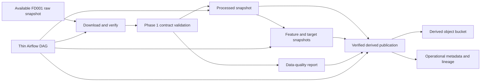

# Phase 3 Architecture

## Objective

Build a deterministic batch ETL pipeline that converts one approved FD001 raw
snapshot into versioned processed data, a minimal feature snapshot, and a
machine-readable data-quality report. Wrap the tested Python stages with a thin
Apache Airflow DAG that demonstrates scheduling, retry, failure, and backfill
behavior without changing artifact identity.

Phase 3 does not train models, choose model features from performance evidence,
run MLflow, serve predictions, monitor models, add agents, or claim streaming or
real-time behavior.

## Scope correction

FD001 is a fixed, simulated run-to-failure dataset. A daily Airflow schedule is
therefore an orchestration demonstration, not evidence of new daily telemetry.
The Airflow logical date is recorded as execution metadata but is not part of a
dataset or feature identity. A backfill over the same immutable source must
reuse the same derived artifacts.

The phrase "feature generation" does not authorize speculative rolling,
scaling, PCA, feature selection, or target-informed transformations. Phase 3
creates a versioned candidate-feature view from the validated settings and
sensors. Any fitted preprocessing belongs to the engine-disjoint training
partition in Phase 4.

## Component flow



The same application service is called by the command line and the DAG. Airflow
owns scheduling and task-run history; project code owns validation,
transformation, identities, publication, and quality decisions.

## Planned package boundaries

```text
src/predictive_maintenance/etl/
  __init__.py
  models.py
  extraction.py
  transformation.py
  features.py
  quality.py
  publication.py
  pipeline.py
  cli.py

orchestration/airflow/
  Dockerfile
  requirements.txt
  dags/
    fd001_etl.py
```

- `models` owns derived snapshot identities and stable ETL errors.
- `extraction` materializes only verified raw objects for one available source
  snapshot.
- `transformation` produces canonical processed tables.
- `features` separates candidate inputs from target columns without fitting on
  the dataset.
- `quality` produces bounded deterministic JSON evidence.
- `publication` extends the existing staged object/metadata publication model.
- `pipeline` composes pure stages and exposes stage-level entry points.
- `cli` runs the complete flow without Airflow.
- the DAG declares only schedule, dependencies, parameters, retries, timeouts,
  and small identifier exchange.

The exact module count may be reduced during implementation. A generic ETL
framework, plugin system, or service decomposition is not required.

## Input gate

Phase 3 accepts only a source snapshot that:

- exists in operational metadata;
- is in the `available` state;
- references all required Phase 1 raw objects;
- passes object size and SHA-256 reconciliation;
- contains the accepted `fd001-v1` contract and parser versions; and
- passes the existing executable Phase 1 schema and semantic validation after
  extraction.

An unknown, inconsistent, missing, mismatched, or contract-invalid source fails
closed before a processed or feature snapshot becomes available.

## Processed data contract

The planned contract name is `fd001-processed-v1`.

The processed snapshot contains separate train and test Parquet files with:

- deterministic source row order;
- exact ordered columns `engine_id`, `cycle`, three settings, 21 sensors, `rul`,
  and `failure_risk_30`;
- Phase 1 integer and floating-point dtypes preserved explicitly;
- no imputation, sorting, row removal, scaling, capping, or inferred timestamp;
  and
- metadata marking test RUL and risk as evaluation targets, never inference
  inputs.

Parquet is selected because it preserves typed tabular data efficiently and is
widely supported by pandas and scikit-learn. The implementation will pin the
PyArrow version, compression, column order, row order, index behavior, and
writer options. Two clean builds in the locked environment must produce the
same logical manifest and object hashes.

## Feature snapshot contract

The planned feature specification is `fd001-candidate-features-v1`.

It produces separate, key-aligned files:

- train candidate features;
- train targets;
- test candidate features; and
- test targets.

`engine_id` and `cycle` remain join and partition keys. Candidate feature
columns are the three settings and 21 sensor measurements. Target files contain
uncapped `rul` and inclusive `failure_risk_30`. Labels must not appear in a
candidate-feature column.

This first feature snapshot is intentionally simple. It proves deterministic
feature materialization and column-role separation without making an
unvalidated claim that engineered windows improve prediction. Scaling,
imputation, feature selection, PCA, target capping, and any fitted statistic are
deferred to Phase 4 or 5 and must be fitted only on the training engines.

## Derived identity and object layout

A derived snapshot ID is the SHA-256 of a canonical manifest containing:

- the parent snapshot ID;
- artifact kind;
- processed-contract or feature-specification version;
- transformation and serializer versions;
- ordered output filenames, byte sizes, SHA-256 values, schemas, and column
  roles; and
- the producing code revision as provenance, not as a substitute for content
  identity.

Planned object keys are content-addressed:

```text
processed/fd001/<contract-version>/<source-snapshot-id>/<sha256>/<filename>
processed/fd001/<contract-version>/<source-snapshot-id>/<derived-id>/manifest.json
features/fd001/<feature-version>/<processed-snapshot-id>/<sha256>/<filename>
features/fd001/<feature-version>/<processed-snapshot-id>/<derived-id>/manifest.json
reports/data-quality/<pipeline-version>/<source-snapshot-id>/<sha256>/report.json
```

Uploads use put-if-absent and downloaded hash verification. Identical reruns
reuse objects. A different object at an existing key fails closed. These are
application-enforced immutable snapshots, not WORM storage.

## Data-quality report

The report is canonical JSON and contains only bounded aggregate evidence:

- source and derived snapshot references;
- contract, pipeline, feature, and serializer versions;
- row, engine, and column counts;
- null, duplicate-key, cycle-order, finite-value, and label-boundary results;
- input/output hash references;
- stable rule IDs and at most five sanitized examples for failures;
- overall `passed` or `failed` status; and
- execution metadata that is excluded from artifact identity where it would
  make identical data non-deterministic.

Raw rows, credentials, private endpoints, absolute paths, and DataFrames are
not written to Airflow logs or XCom.

## PostgreSQL extension

Phase 3 will add one forward-only migration in the private `ops` schema. The
minimum planned tables are:

| Table                        | Responsibility                                                  |
| ---------------------------- | --------------------------------------------------------------- |
| `ops.derived_snapshots`      | Processed/feature/report identity, parent, contract, state      |
| `ops.derived_snapshot_files` | Ordered verified objects belonging to a derived snapshot        |
| `ops.transformation_runs`    | Idempotency key, versions, state, timestamps, sanitized failure |

The existing `ops.data_objects` and `ops.lineage_edges` tables remain the
authorities for stored object identity and parent-child edges. Existing
`derived_from` and `reported_by` relationship types are reused.

The migration keeps `ops` outside the Data API, uses the existing restricted
runtime role, explicitly revokes `PUBLIC`, `anon`, and `authenticated`, enables
RLS as defense in depth, and adds only the grants required by ETL. Airflow has a
separate metadata database and user; its internal tables never enter `ops`.

## Publication and recovery

Storage and PostgreSQL still cannot share a transaction. Each stage therefore:

1. validates the complete parent snapshot;
1. calculates output files and canonical manifests in a temporary workspace;
1. uploads or verifies every content-addressed object;
1. commits derived snapshot, file, lineage, report, and run metadata in one
   PostgreSQL transaction;
1. reconciles referenced objects; and
1. returns only stable snapshot IDs.

A database failure may leave verified orphan objects. Retry reuses them.
Reconciliation reports but does not silently delete or repair them. A missing
or mismatched referenced derived object changes the derived snapshot to
`inconsistent` and blocks downstream use.

## Airflow topology

Phase 3 will use the current reviewed Apache Airflow 3 release, with the exact
version and official Python 3.11 image pinned during implementation. The
planning reference is Airflow 3.3.0.

The local topology is deliberately small:

- one extended official Airflow image;
- `LocalExecutor` with low bounded parallelism;
- one local Airflow runtime for development and integration testing;
- one dedicated Airflow database and user inside the disposable PostgreSQL
  container; and
- the existing application database kept separate from Airflow metadata.

No Celery worker, Redis broker, Kubernetes executor, Helm chart, or cloud
Airflow deployment is included. The local standalone-style runtime is
development evidence, not a production deployment claim.

The DAG is planned as `fd001_derived_pipeline` with stable stages:

```text
validate_source
  -> publish_processed
  -> publish_candidate_features
  -> verify_quality_and_lineage
```

Tasks may re-download an object by identity. They do not depend on another
task's local temporary files. XCom contains only bounded identifiers and status
data.

## Schedule, retry, and backfill semantics

- Schedule: one daily batch schedule with `catchup=False` for normal operation.
- Source: an explicit approved snapshot ID; no implicit mutable "latest" input.
- Concurrency: one active DAG run by default.
- Retry: bounded retries with exponential backoff and task timeouts.
- Backfill: explicit Airflow backfill with bounded concurrency and declared
  reprocessing behavior.
- Identity: Airflow logical date and run ID do not change derived artifact IDs.
- Failure: a failed task leaves no available partial snapshot; retry or backfill
  converges on the same objects and metadata.

Backfill over this static FD001 snapshot demonstrates orchestration semantics
only. It does not represent historical event-time partitions because `cycle` is
not a timestamp.

## Local and cloud evidence

### Local

- pure ETL functions run without Airflow;
- filesystem plus PostgreSQL 17 validate end-to-end publication;
- the Airflow image imports the DAG with zero errors;
- direct and DAG-triggered runs produce identical snapshot IDs and hashes;
- retry, controlled failure, backfill, and idempotency are exercised; and
- the ignored owner-provided FD001 files are exercised separately from CI
  fixtures.

### Hosted Supabase

After separate target and mutation confirmation, the approved development/test
project will exercise the Phase 3 migration, derived Storage objects, metadata,
lineage, exact rerun reuse, reconciliation, and advisors. Ordinary CI contains
no Supabase credentials and performs no cloud mutation.

If the workstation still cannot reach hosted PostgreSQL ports, Storage through
the Python adapter and database checks through authenticated project-scoped SQL
tools will be recorded as separate evidence. That split must not be described
as a hosted end-to-end Python database-adapter run.

## Security boundaries

- Airflow UI/API ports bind to loopback for local development.
- Development-only Airflow credentials and encryption keys remain ignored.
- DAG parsing performs no network, database, object, or filesystem mutation.
- Secrets come from environment or Airflow connections and are never passed by
  XCom or logged.
- Object and report keys reject traversal and remain inside approved prefixes.
- Parquet is used instead of unsafe executable serialization such as pickle.
- Input sizes, row counts, error examples, XCom values, and log output are
  bounded.
- Cloud tests clean only generated integration prefixes; approved durable raw
  and derived objects are not deleted silently.

## Explicit exclusions

- model splitting, preprocessing fitting, training, metrics, MLflow, or model
  performance gates;
- speculative rolling features, PCA, feature selection, RUL capping, or target
  leakage;
- streaming, Kafka, Realtime, event-time synthesis, or hard/near-real-time
  claims;
- Celery, Redis, Kubernetes, Helm, managed Airflow, or production orchestration;
- row-level telemetry in PostgreSQL or Airflow XCom;
- automatic cleanup of orphaned or inconsistent artifacts;
- Auth, dashboard, serving, monitoring, agents, or deployment; and
- paid cloud provisioning.

## Planning references

- [Apache Airflow installation](https://airflow.apache.org/docs/apache-airflow/stable/installation/index.html)
- [Apache Airflow best practices](https://airflow.apache.org/docs/apache-airflow/stable/best-practices.html)
- [Apache Airflow DAG concepts and testing](https://airflow.apache.org/docs/apache-airflow/stable/core-concepts/dags.html)
- [Apache Airflow backfill](https://airflow.apache.org/docs/apache-airflow/stable/core-concepts/backfill.html)
- [Apache Airflow LocalExecutor](https://airflow.apache.org/docs/apache-airflow/stable/core-concepts/executor/local.html)
- [Apache Airflow Docker Compose guidance](https://airflow.apache.org/docs/apache-airflow/stable/howto/docker-compose/)
