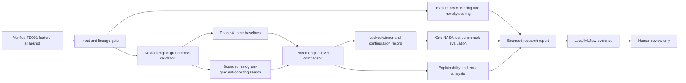

# Phase 5 Architecture

## Objective

Determine whether a bounded nonlinear scikit-learn model adds reliable value
over the approved Phase 4 linear baselines. Add honest uncertainty around the
comparison, exploratory clustering and anomaly scoring, and reproducible
explainability/error analysis.

Phase 5 is a research comparison phase. It does not guarantee that a more
complex model will win. If the evidence gate fails, the Phase 4 model remains
the preferred model.

## Scientific claim boundary

C-MAPSS FD001 is simulated historical telemetry with one operating condition
and one fault mode. Its failure-risk label is calculated directly from RUL:
`failure_risk_30 = 1` when `rul <= 30`. It is not an independently observed
failure event.

Therefore:

- clusters may be called **exploratory telemetry states**, not true health
  states;
- anomaly output is a **novelty score**, not a verified fault alarm;
- metric confidence intervals describe evaluation uncertainty, not
  per-prediction uncertainty or a safety guarantee;
- Phase 5 does not create a physical or bidirectional digital twin;
- no result proves field performance, real-time behavior, autonomy, or
  continuous retraining; and
- the NASA test results were already observed in Phase 4, so Phase 5 calls that
  partition a locked benchmark, not a previously unseen or blind holdout.

## Component flow



MLflow records experiments. It does not register, promote, serve, or deploy a
model in this phase.

## Input and target boundary

Phase 5 reuses one explicit, available, reconciled
`fd001-candidate-features-v1` snapshot and its Phase 4 lineage checks. The model
matrix remains exactly the three settings and 21 sensors. `engine_id` and
`cycle` remain keys. `rul` and `failure_risk_30` remain targets and cannot enter
the model matrix.

RUL remains uncapped and the risk horizon remains 30 cycles. Target capping,
new rolling features, PCA as a supervised feature transform, alternate risk
horizons, and FD002-FD004 are excluded so the model comparison is not
confounded by simultaneous data and target changes.

## Development and benchmark protocol

The Phase 4 80/20 manifest remains immutable evidence, but Phase 5 creates a
new child comparison manifest over all 100 NASA source-training engines:

1. five deterministic outer `GroupKFold` folds estimate model-family
   performance;
1. four deterministic inner engine-group folds tune only the nonlinear model
   inside each outer training fold;
1. all preprocessing and fitted statistics remain inside the fold;
1. every source-training row receives exactly one outer out-of-fold
   prediction;
1. the linear baseline and nonlinear candidate are compared on the same outer
   folds; and
1. after the comparison decision is locked, the selected configuration is fit
   on all source-training engines and evaluated once on the NASA test
   benchmark.

The tuning/evaluation API must not accept NASA test features or targets. A
separate benchmark command requires the hash of a completed locked-selection
record. Re-running the benchmark cannot change the selected family,
hyperparameters, features, threshold, or gate.

Because Phase 4 already reported NASA test metrics, Phase 5 will explicitly
record prior exposure as a limitation. The separate command and immutable
selection record reduce new leakage; they cannot recreate a truly blind test.

## Bounded supervised comparison

Each task compares its unchanged Phase 4 candidate with one nonlinear family:

| Task           | Reference                                 | Advanced family                  | Primary metric                    |
| -------------- | ----------------------------------------- | -------------------------------- | --------------------------------- |
| RUL regression | scaled Ridge                              | `HistGradientBoostingRegressor`  | engine-balanced RMSE              |
| Failure risk   | scaled class-balanced logistic regression | `HistGradientBoostingClassifier` | engine-balanced average precision |

The nonlinear search uses a checked-in finite grid of eight configurations
configurations per task, five outer folds, four inner folds, fixed seeds, and
bounded parallelism. There is no Bayesian optimizer, unbounded search, test-set
retry, GPU requirement, or new deep-learning framework.

The classification threshold remains 0.5. Calibration is measured through
engine-balanced Brier and reliability summaries, but no production threshold
or maintenance cost is invented.

## Complexity decision gate

Paired bootstrap samples resample whole engines from the outer out-of-fold
predictions with a fixed seed and 2,000 replicates.

The advanced regression model is preferred only when:

- engine-balanced RMSE improves by at least 3% over Ridge;
- the 95% paired bootstrap interval for the RMSE improvement is above zero;
  and
- engine-balanced MAE and NASA score do not worsen by more than 5%.

The advanced classifier is preferred only when:

- engine-balanced average precision improves by at least 0.005 absolute;
- the 95% paired bootstrap interval for that improvement is above zero; and
- engine-balanced Brier score does not worsen by more than 0.01 absolute.

Passing this gate means “preferred for later Phase 6 review,” not approved,
registered, deployable, or safe. Failure of an advanced candidate is a valid
Phase 5 outcome and leaves the linear baseline preferred.

## Optional complexity gates

A simple ensemble may be evaluated only from already locked out-of-fold
predictions, with weights chosen without NASA test data. It is retained only if
it passes the same task gate and improves on the best single model. Otherwise
it is rejected and its evidence remains recorded.

A multi-task neural network is not part of the default implementation. The
classification target is a deterministic threshold of the regression target,
so two heads do not provide independent supervision. FD001 also contains only
100 source-training engines. Adding a deep-learning dependency requires a
written plan amendment, a distinct falsifiable hypothesis, a compute budget,
an ablation against single-task models, and explicit owner approval. Without
all of those, Phase 5 records the neural option as not justified.

## Evaluation uncertainty

Phase 5 reports point metrics and paired 95% engine-bootstrap intervals for
model differences. Resampling engines, rather than individual rows, preserves
the trajectory grouping and prevents long engines from appearing as thousands
of independent samples.

This is uncertainty about measured model performance. Formal per-prediction
RUL intervals are deferred because correlated cycles and previously observed
test results require a separate coverage protocol. The project must not label
the bootstrap interval as predictive uncertainty.

## Exploratory telemetry states

Clustering uses only NASA source-training inputs. It fits a scaler and PCA
retaining 95% variance inside the analysis path, samples at most 100 cycles per
engine, and evaluates a fixed `KMeans` range of two through six clusters across
fixed seeds. A cluster count is supported only when mean pairwise adjusted
Rand stability is at least 0.80; the stable candidate with the best silhouette
score wins. RUL is not used to fit or select the clusters.

After the method is locked, bounded post-hoc summaries may show how cluster
occupancy relates to lifecycle bands and RUL. This association is descriptive;
it does not turn clusters into ground-truth health labels. If no stable
structure exists, the accepted conclusion is “no supported telemetry-state
partition.”

## Novelty scoring

One `IsolationForest` family with `contamination="auto"` is fit across three
fixed seeds on an engine-balanced early-life reference sample where
`cycle / max_training_cycle_for_engine <= 0.20`. It produces a continuous
novelty score. Fixed-seed stability and early/middle/late score distributions
are reported. RUL or risk labels cannot tune the detector or contamination
setting.

FD001 has no anomaly labels, so precision, recall, detection delay, and fault
detection accuracy are unavailable. The result cannot automatically create a
maintenance alert.

## Explainability and error analysis

Explanation uses held-out outer-fold predictions only:

- scaled linear coefficients for the Phase 4 references;
- repeated permutation importance for the nonlinear candidate;
- stability of feature rankings across outer folds;
- regression residuals by engine and lifecycle band;
- classification errors, calibration, and confusion summaries by lifecycle
  band; and
- bounded best/worst engine summaries with no complete telemetry dump.

Explanation results cannot be used to silently remove features or rerun the
search. Any feature-selection experiment requires a new versioned protocol.

## Tracking and artifact boundary

Phase 5 reuses the approved loopback-only MLflow server, local SQLite backend,
ignored artifact root, explicit logging, and trusted `skops` loading controls.
Runs bind the feature snapshot, Phase 4 split, Phase 5 fold manifest, search
space, fold results, out-of-fold prediction digest, bootstrap settings,
selection record, analysis versions, code revision, dependencies, and seeds.

Only bounded aggregate reports and verified model artifacts are stored. No
full telemetry table, complete prediction dump, credential, private endpoint,
absolute path, registered-model version, alias, promotion, or deployment
record is allowed.

## Implemented package boundary

Phase 5 extends the existing modular modeling package rather than creating a
second framework:

```text
src/predictive_maintenance/modeling/
  advanced.py
  comparison.py
  unsupervised.py
  phase5_models.py
  phase5_pipeline.py
  phase5_cli.py
  phase5_runtime.py
  phase5_tracking.py
```

Existing loading, split, metrics, tracking, runtime, and trusted artifact code
is reused or narrowly generalized.

## Exercised FD001 result

The owner-provided FD001 run selected histogram gradient boosting for RUL
regression. Engine-balanced outer-fold RMSE improved from 42.323 to 40.767;
the paired improvement was 1.556 cycles with a 95% whole-engine interval from
0.334 to 2.813, and every regression guardrail passed.

The advanced classifier did not justify its complexity. Engine-balanced outer
average precision changed from 0.9466 for logistic regression to 0.9446 for
histogram gradient boosting. The paired difference was -0.0020 with a 95%
interval from -0.0080 to 0.0039, so the locked selection retained logistic
regression.

The training-only exploratory analysis supported two stable telemetry clusters
(mean pairwise adjusted Rand 0.9997, mean silhouette 0.3186) after retaining
12 PCA components and sampling 100 cycles from each of 100 engines. The
novelty-score seed stability was 0.9647. These descriptive results are not
ground-truth health states or verified anomaly detection.

## Explicit exclusions

- FD002-FD004 ingestion or cross-domain claims;
- changed labels, capped RUL, new feature snapshots, or supervised PCA;
- deep learning without a separately approved plan amendment;
- model registry, alias, promotion, serving, FastAPI, or deployment;
- Supabase migration or Storage mutation;
- Airflow-scheduled training, monitoring, drift, or retraining triggers;
- agents, dashboard, Auth, Realtime, or streaming; and
- production, physical-twin, real-time, autonomous, or safety claims.
