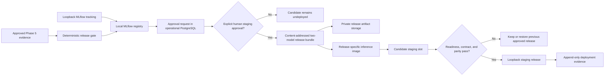

# Phase 6 Architecture

## Objective

Turn the two owner-approved Phase 5 model choices into one traceable release,
register their exact artifacts, expose a strict FastAPI inference contract, and
prove container startup, staging smoke tests, and rollback.

Phase 6 creates deployment evidence for a research prototype. It does not make
the models production-ready, validate them on physical engines, or authorize an
automatic production deployment.

## Refined claim boundary

- The deployed input is one or more cycle-level FD001 telemetry observations,
  not a live stream.
- The service is a local or ephemeral staging service, not a public production
  endpoint.
- The RUL model and failure-risk model provide research predictions from
  simulated telemetry.
- Phase 5 bootstrap intervals describe evaluation uncertainty. They are not
  per-request predictive intervals and will not be returned as such.
- A registered model is only a candidate. Registration does not equal approval,
  promotion, deployment, safety certification, or maintenance authority.
- MLflow aliases are mutable references. The inference service loads an
  immutable release ID and never follows a mutable alias at request time.
- No agent can register, approve, promote, deploy, or roll back a model.

## Selected model pair

The Phase 6 release contains exactly the Phase 5 selections:

| Task                  | Selected family                    | Reason                                                                    |
| --------------------- | ---------------------------------- | ------------------------------------------------------------------------- |
| RUL regression        | Histogram gradient boosting        | Passed the Phase 5 paired engine-level complexity gate                    |
| 30-cycle failure risk | Class-balanced logistic regression | Advanced classifier failed the Phase 5 gate, so the baseline was retained |

The two task models are released together because the API returns both outputs
for the same 24-feature observation. They remain separately registered and
separately identifiable inside the release manifest.

## Component flow



## Registry and approval boundary

MLflow remains the owner of registered model names, versions, source run IDs,
tags, and aliases. Phase 6 uses the existing database-backed loopback server and
local artifact root. It does not introduce an unauthenticated remote MLflow
server.

The implemented registered names are:

- `fd001-rul-regression`; and
- `fd001-failure-risk-classification`.

Each version must point to the exact verified Phase 5 run artifact. Registration
copies no untrusted pickle or joblib object. The existing `skops` digest,
signature, trusted-type, provenance, and prediction-parity checks remain
mandatory.

Operational PostgreSQL, not MLflow tags or aliases, owns approval and deployment
events. The forward-only Phase 6 migration adds private `ops` records for:

- a release candidate and its immutable evidence snapshot;
- human approval or rejection events;
- deployment attempts and outcomes; and
- rollback events and the restored release ID.

The normal runtime role receives only the minimum insert/select operations.
`PUBLIC`, `anon`, and `authenticated` receive no access. The `ops` schema stays
outside the Supabase Data API.

Registration creates candidate versions only. A deterministic gate must pass
before an approval request can be opened. The owner must then send a separate
explicit command containing the release ID before the implementation may set a
`staging` alias or deploy the actual FD001 release. No `production` alias is
created in Phase 6.

## Deterministic release gate

The gate fails closed unless all of the following match:

1. the approved Phase 5 feature, split, comparison, and locked-selection IDs;
1. histogram gradient boosting for regression and logistic regression for
   classification;
1. the source MLflow run IDs and run ownership;
1. exact 24-feature input order and output rules;
1. model artifact SHA-256 values, signatures, and allowed `skops` types;
1. prediction parity on a bounded approved verification fixture;
1. the 30-cycle inclusive risk horizon and fixed 0.5 classification threshold;
1. the code revision, Python version, dependency-lock digest, and protocol
   versions; and
1. current formatting, typing, tests, container, and dependency-security gates.

The gate does not invent a new absolute production-performance threshold. It
checks that the release is exactly the model pair selected by the approved
Phase 5 protocol and that packaging has not changed behavior.

## Immutable release bundle

One canonical release manifest binds:

- release contract version and SHA-256 release ID;
- Phase 5 selection and comparison IDs;
- feature, processed, raw, and split identities;
- both registered model names, versions, source runs, task roles, artifact
  digests, signatures, and trusted types;
- ordered feature names, dtypes, and finite-value requirements;
- output flooring, probability bounds, risk horizon, and threshold;
- code revision, Python version, dependency-lock digest, and image metadata;
- approval evidence ID; and
- a pointer to the previous approved staging release when one exists.

The bundle contains canonical JSON plus the two verified `skops` artifacts. It
is written to an ignored local content-addressed directory. If hosted
verification is approved after `START PHASE 6`, the same bytes are published
with put-if-absent behavior under a private derived-bucket prefix such as:

```text
models/releases/<release-id>/release-manifest.json
models/releases/<release-id>/rul/model.skops
models/releases/<release-id>/risk/model.skops
```

Every uploaded byte is downloaded and rehashed before acceptance. Supabase
Storage is not called an MLflow registry, WORM store, or deployment platform.

## FastAPI contract

The service exposes only:

```text
GET  /health/live
GET  /health/ready
GET  /v1/release
POST /v1/predict
```

`/health/live` proves that the process is running. `/health/ready` returns
success only after both models, the release manifest, signatures, digests, and
prediction-parity fixture have passed startup verification.

`/v1/predict` accepts a bounded batch of 1 to 128 observations. Each observation
contains positive `engine_id` and `cycle` provenance plus the exact three
settings and 21 sensor values. Identity fields are never passed into either
model. Values must be finite numbers; missing, extra, non-numeric, non-finite,
or oversized inputs are rejected before inference.

Each response item contains:

- `engine_id` and `cycle`;
- non-negative `rul_cycles`;
- failure-risk probability in `[0, 1]`;
- thresholded risk label, horizon 30, and threshold 0.5;
- release ID and both immutable model version references; and
- `predictive_uncertainty_status: not_available`.

The service does not manufacture a per-prediction confidence interval. Errors
use stable codes and bounded messages without telemetry dumps, credentials,
private endpoints, stack traces, or absolute paths.

## Early UI design boundary

Phase 6 defines the technology-neutral screen hierarchy, low-fidelity layouts,
shared states, safety wording, accessibility expectations, and backend
dependency map in [`../../UI_ARCHITECTURE.md`](../../UI_ARCHITECTURE.md).

This design work does not add a frontend framework, browser bundle, dashboard
service, direct database access, or live screen. The Phase 6 inference contract
may become one stable dependency for later screens, but no screen connects to
it in this phase. Monitoring contracts belong to Phase 7, agent and
recommendation contracts belong to Phase 8, and the working UI plus
screen-by-screen integration belong to Phase 9.

A static example or mock may inform design review only when visibly labelled
`DESIGN ONLY`. It is not API, container, staging, or integration evidence.

## Container and staging topology

The default Phase 6 staging target is one loopback-only Docker Compose service
on the owner workstation. A separate ephemeral GitHub protected-environment
workflow may repeat the same deployment mechanics with a synthetic release. It
does not create a persistent public service.

The inference image:

- use an official Python 3.11 base pinned by digest;
- install from the committed lock-derived runtime dependency set;
- run one application process as a non-root user;
- use exec-form startup and a Docker health check;
- contain one immutable release bundle and no build-time or runtime secret;
- use a read-only filesystem and dropped Linux capabilities where supported;
- bind the host port only to `127.0.0.1`; and
- record image and release identities separately.

The application loads both models once during FastAPI lifespan startup. It does
not query MLflow, Supabase, or PostgreSQL for each request.

## Staging promotion and rollback

Deployment is separate from pull-request CI.

1. Build the release-specific image.
1. Start it in an isolated candidate slot.
1. require liveness, readiness, OpenAPI, invalid-input, and known-prediction
   smoke tests;
1. compare container predictions with the approved local model outputs;
1. record the deployment outcome; and
1. switch the local staging reference only after all checks pass.

If candidate startup or smoke tests fail, the previous staging release remains
active. If a post-switch verification fails, the rollback command restores the
previous immutable release and records both the failed and restored release
IDs. The planned local recovery-time objective is five minutes; it becomes an
evidence claim only if measured successfully.

The actual rollback drill rejected the known synthetic release by immutable
release ID and restored the approved release in 12.61 seconds. The approved
service passed prediction parity after restoration. This is local staging
evidence, not a public availability claim.

GitHub pull-request CI remains credential-free and never deploys. A separate
manual staging workflow uses `workflow_dispatch` and a protected `staging`
environment. Because a newly added manual workflow is not dispatchable until
it exists on the default branch, its first real run remains unexercised. A PR
container smoke test is not protected staging-workflow evidence.

## Security boundary

- The loopback staging API has no user authentication and must not be exposed
  publicly. Auth and public ingress require a later approved design.
- The service image contains no Supabase, PostgreSQL, GitHub, or MLflow
  credential.
- Registry and deployment tools use separate credentials from the inference
  runtime.
- Request size, batch size, validation time, model load, startup, and smoke
  polling are bounded.
- Logs record request IDs, release IDs, status, latency, and item count, but not
  full feature vectors or full responses.
- Model loading accepts only the manifest-declared `skops` trusted types.
- A mutable MLflow alias cannot change a running release.

## Explicit exclusions

- production hosting, public ingress, TLS termination, autoscaling, SLA, or
  high availability;
- automatic production deployment or automatic model promotion;
- per-prediction uncertainty intervals;
- monitoring, drift, delayed-label performance, or retraining triggers;
- digital-shadow persistence or working dashboard implementation;
- Supabase Auth, Realtime, agents, streaming, or physical-control integration;
- FD002-FD004 generalization; and
- claims of real-time, autonomous, safety-critical, or field-validated use.
