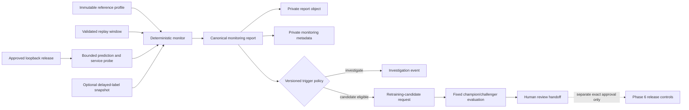

# Phase 7 Architecture

## Objective

Add a conventional, deterministic monitoring and retraining-candidate workflow
around the approved Phase 6 staging release. The workflow will measure data
quality, feature and prediction distribution shift, sampled service behavior,
and model performance when matching labels are available. It may open a
governed investigation or challenger-evaluation request, but it cannot change
an MLflow alias, deploy a release, or approve a model.

## Refined claim boundary

- FD001 remains static simulated telemetry. Monitoring uses ordered
  cycle-level replay windows, not a live industrial stream.
- A statistical shift is evidence that distributions differ. It does not by
  itself prove model degradation, a physical fault, or a need to retrain.
- Expected lifecycle change can look like drift. Reports must expose lifecycle
  mix and operating-setting context before interpreting a shift.
- Service health is measured from bounded local probes. It is not an uptime,
  availability, SLA, or production-observability claim.
- Delayed-label performance is `unavailable` until an independently attached,
  key-aligned label snapshot exists. Missing evidence is never converted to
  zero degradation or a healthy state.
- A retraining trigger creates an immutable request for evaluation. It does not
  train, register, promote, deploy, or roll back a model automatically.
- NASA test data is already observed benchmark evidence. Phase 7 will not add
  it to training data or describe it as new production feedback.
- A challenger that passes evaluation is only eligible for human review. The
  exact Phase 6 release, approval, staging, and rollback controls remain in
  authority.

## Starting point

Phase 7 builds on these approved Phase 6 facts:

- one immutable two-model release is active on loopback staging;
- the service exposes liveness, readiness, release metadata, and bounded
  predictions;
- the release contains exact feature, model, selection, and dependency
  identities;
- private Supabase Storage and private operational PostgreSQL already hold
  release evidence; and
- there is no production target, public endpoint, working UI, or automatic
  promotion path.

## Component flow



No arrow from monitoring or evaluation directly reaches an MLflow alias or
deployment target.

## Monitoring window contract

One `fd001-monitoring-window-v1` manifest will bind:

- raw, processed, feature, target, and release identities;
- source partition and ordered engine/cycle membership;
- replay sequence identity, not a fabricated event timestamp;
- prediction request and response contract versions;
- reference-profile and monitor-policy identities;
- optional delayed-label snapshot identity;
- row and engine counts plus lifecycle-band composition;
- code, dependency, and monitoring-protocol versions; and
- canonical file identities and SHA-256 values.

The window is immutable. Re-running the same window and policy must either
reuse the exact report or fail on conflicting bytes. A different policy,
release, window membership, or label attachment creates a different identity.

The actual FD001 demonstration will use engine-balanced replay from the NASA
test partition. It will preserve `(source_partition, engine_id, cycle)` as the
row key and will never treat Airflow logical time as telemetry time.

## Reference profile

`fd001-monitor-reference-v1` will be built from the exact approved source
training inputs used by the release. Sampling is bounded and engine-balanced
so long trajectories do not dominate. It will contain only aggregate evidence:

- fixed per-feature quantile bins and counts;
- finite-value, range, median, and interquartile summaries;
- lifecycle and operating-setting composition;
- reference RUL and risk-output distribution summaries;
- reference delayed-label performance evidence where valid; and
- minimum sample requirements and calibrated alert thresholds.

Thresholds must be chosen from the reference evidence before the monitored
window is evaluated. They are research thresholds for this versioned FD001
protocol, not universal industrial limits.

## Signal separation

| Signal class        | Planned evidence                                                                 | What it cannot prove                |
| ------------------- | -------------------------------------------------------------------------------- | ----------------------------------- |
| Data quality        | schema, keys, missing/non-finite values, cycle order, release and lineage checks | model degradation                   |
| Feature shift       | per-feature PSI, robust location shift, exceeded reference range, lifecycle mix  | a physical fault or need to retrain |
| Prediction shift    | RUL and risk-probability PSI, location shift, risk-prevalence change             | prediction error without labels     |
| Service health      | readiness, response status, bounded request count, p50/p95/max latency           | production availability or SLA      |
| Delayed performance | engine-balanced RMSE/MAE/NASA score and AP/Brier evidence after label attachment | field performance outside FD001     |

Project-owned NumPy/Pandas metrics are the baseline. Evidently is not added in
the initial implementation because the required metrics and report schema are
small and deterministic. It may be reconsidered only if a documented gap
remains after the custom contracts are exercised.

Every signal has one of these explicit states:

- `pass`;
- `warning`;
- `alert`;
- `insufficient_data`;
- `unavailable`; or
- `invalid`.

An invalid data-quality result blocks drift, performance, and retraining
decisions for that window.

## Trigger policy

`fd001-monitor-trigger-policy-v1` is deterministic and versioned:

- data-quality failure opens a data investigation and prohibits retraining;
- readiness or error failure opens a service investigation and prohibits
  retraining;
- one feature or prediction shift opens an investigation, not a candidate;
- persistent adequate-sample drift across independent windows may request a
  candidate evaluation;
- confirmed performance degradation with matching labels may request a
  candidate evaluation; and
- unavailable or insufficient evidence never requests promotion.

The candidate-request ID hashes the release, policy, immutable data cutoff,
window/report evidence, and requested task. Repeated evaluation is idempotent;
conflicting evidence fails closed.

## Delayed-label behavior

Predictions are generated and fixed before labels are attached. A separate
operation accepts one exact target-snapshot reference, verifies row-key
alignment, and creates a new performance-evidence identity. It cannot replace
or edit the earlier prediction report.

The first report must state `performance_status: unavailable`. After a valid
attachment, the report may state `available` and include bounded aggregate
metrics. A missing row, duplicate key, wrong source partition, mismatched
snapshot, or future-label leak fails closed.

## Champion/challenger evaluation

The approved Phase 6 release is the champion. A challenger evaluation must:

1. reference one immutable candidate request and approved training cutoff;
1. exclude NASA test rows from fitting and configuration selection;
1. use the existing engine-group leakage controls;
1. reproduce the same feature and label contracts;
1. compare champion and challenger on identical fixed evaluation rows;
1. use paired whole-engine evidence and the approved Phase 5 practical
   guardrails;
1. verify signatures, trusted types, predictions, dependencies, and release
   compatibility; and
1. produce an eligibility report without changing registry aliases or staging.

FD001 supplies no genuinely new training population after Phase 5. Therefore,
the actual-data path is expected to produce a deduplicated/no-change or
`blocked_no_new_training_data` result unless the owner later approves a new
versioned dataset. Synthetic fixtures will exercise both passing and failing
challenger mechanics without being reported as actual-model evidence.

If a future actual challenger becomes eligible, Phase 7 must stop before any
alias or deployment mutation and request a separate exact release approval.
The existing immutable release, candidate-slot smoke test, human approval, and
rollback path remain mandatory.

## Persistence and lineage

Canonical reports are stored under private, content-addressed derived keys:

```text
reports/monitoring/<release-id>/<window-id>/<report-id>.json
reports/retraining/<request-id>/<evaluation-id>.json
```

The private `ops` schema will receive one forward-only Phase 7 migration for:

- monitoring references and windows;
- immutable report metadata and object references;
- append-only monitoring alerts;
- deduplicated retraining-candidate requests; and
- append-only challenger-evaluation outcomes.

Full telemetry vectors and complete prediction dumps remain in temporary or
ignored local evidence only. PostgreSQL stores identities, bounded summaries,
states, and object references. Existing `ops.data_objects` and lineage records
remain the object authorities.

`PUBLIC`, `anon`, and `authenticated` receive no access. The runtime role gets
only the operations required by the batch monitor. The `ops` schema stays
outside the Supabase Data API.

## Execution topology

Core monitoring and trigger logic is ordinary typed Python with CLI entry
points and no Airflow dependency. A thin parameterized Airflow DAG may run one
explicit immutable replay window after the direct path is stable. It will not
use Airflow logical dates as data identity, schedule unattended retraining, or
perform deployment.

The monitor calls only the approved loopback inference contract for actual
service evidence. CI uses a deterministic synthetic release. Hosted Supabase
verification is separate, credentialed evidence and cannot be replaced by the
filesystem/PostgreSQL substitutes.

## UI contract boundary

Phase 7 will stabilize technology-neutral monitoring-report and trigger-status
contracts for the future Monitoring screen. It will update field meaning,
freshness, empty, stale, partial, unavailable, and error states in
`docs/UI_ARCHITECTURE.md`.

No frontend framework, browser bundle, chart, dashboard route, Supabase Auth,
Realtime subscription, or live screen connection belongs to Phase 7. Phase 9
will create the smallest browser-facing read model after Phase 7 is approved.

## Security and privacy boundary

- Monitoring jobs use server-side credentials only and never place them in
  reports, logs, MLflow tags, manifests, images, or Git.
- Reports contain bounded aggregates and identifiers, not complete telemetry
  or unrestricted service traces.
- Error messages are stable, bounded, and redact paths, URLs, headers, DSNs,
  and tokens.
- The inference container remains credential-free and loopback-only.
- A trigger controller has no registry, deployment, rollback, or production
  credential.
- Pull-request CI remains cloud-credential-free and deployment-free.

## Explicit exclusions

- automatic, continuous, online, or unattended retraining;
- automatic MLflow alias changes, promotion, deployment, or rollback;
- adding NASA test data to training;
- production/public monitoring, SLA, paging, or on-call claims;
- Kafka, Prometheus, Grafana, Alertmanager, Supabase Realtime, or Supabase Cron;
- working UI, dashboard authentication, or browser access to private systems;
- agent investigation or recommendation behavior;
- FD002-FD004, live telemetry, physical control, or field-validation claims;
  and
- paid cloud resources.
